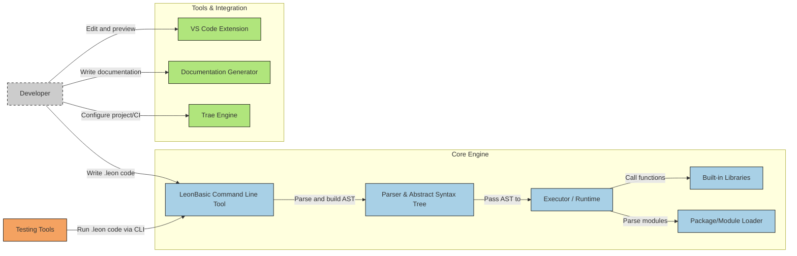

# Welcome to LeonBasic Programming Language

LeonBasic is a simple and easy-to-use interpreted programming language designed for beginners and rapid prototyping. It provides clear and concise syntax while supporting basic programming features such as variables, functions, control flow, file operations, and network capabilities.

Here's its operational diagram:

## Main Features

* **Concise syntax** - Easy to learn and use
* **Built-in libraries** - Including basic operations and network capabilities
* **Flexible variable system** - Supports strings, integers, and floating-point numbers
* **Comprehensive control flow** - Including conditional statements and loops
* **File operations** - Supports reading, writing, and appending to files
* **Network functionality** - Supports HTTP requests and file downloads
* **Error handling** - Provides exception catching mechanisms

## Quick Start

1. Check out the [Getting Started](getting-started.md) guide
2. Learn the [Basic Syntax](basic-syntax.md)
3. Explore advanced features like [Control Flow](control-flow.md), [File Operations](file-operations.md), and more

## Documentation Navigation

Use the left navigation bar to browse the complete documentation, including:

* [Getting Started](getting-started.md) - Installation and usage guide
* [Basic Syntax](basic-syntax.md) - Variables, functions, escape characters, and built-in libraries
* [Module System](module-system.md) - require function and module importing
* [Control Flow](control-flow.md) - Conditional statements and loops
* [File Operations](file-operations.md) - Reading and writing files
* [Network](network.md) - HTTP requests and downloads
* [Error Handling](error-handling.md) - Exception catching
* [User Interaction](user-interaction.md) - Menus and user input