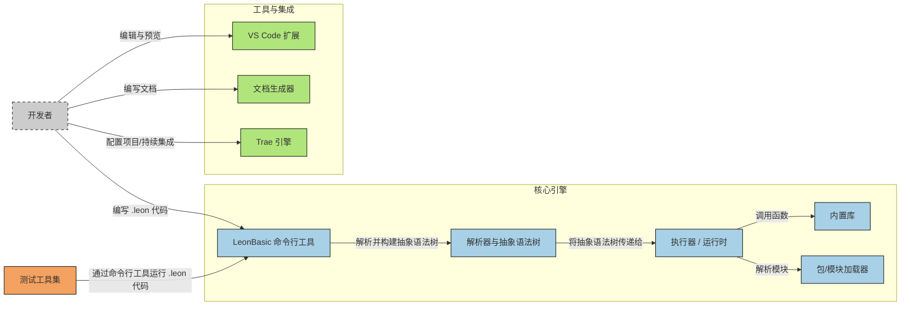

# 欢迎使用 LeonBasic 编程语言

LeonBasic 是一种简单易用的解释型编程语言，专为初学者和快速原型开发设计。它提供了简洁明了的语法，同时支持基本的编程功能，如变量、函数、控制流、文件操作和网络功能等。

这是他的运行原理图：

## 主要特性

* **简洁的语法** - 易于学习和使用
* **内置库支持** - 包含基础操作和网络功能
* **灵活的变量系统** - 支持字符串、整数和浮点数
* **完善的控制流** - 包括条件语句和循环结构
* **文件操作** - 支持文件的读写和追加
* **网络功能** - 支持 HTTP 请求和文件下载
* **错误处理** - 提供异常捕获机制

## 快速开始

1. 查看[快速入门](getting-started.md)指南
2. 学习[基本语法](basic-syntax.md)
3. 探索[控制流](control-flow.md)、[文件操作](file-operations.md)等高级功能

## 文档导航

使用左侧导航栏浏览完整文档，包括：

* [基本语法](basic-syntax.md) - 变量、函数和内置库
* [控制流](control-flow.md) - 条件语句和循环
* [文件操作](file-operations.md) - 读写文件
* [网络功能](network.md) - HTTP 请求和下载
* [错误处理](error-handling.md) - 异常捕获
* [用户交互](user-interaction.md) - 菜单和用户输入
* [快速入门](getting-started.md) - 安装和使用指南
